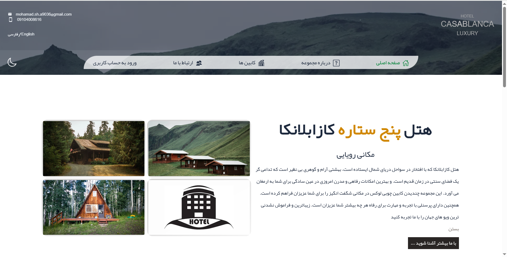
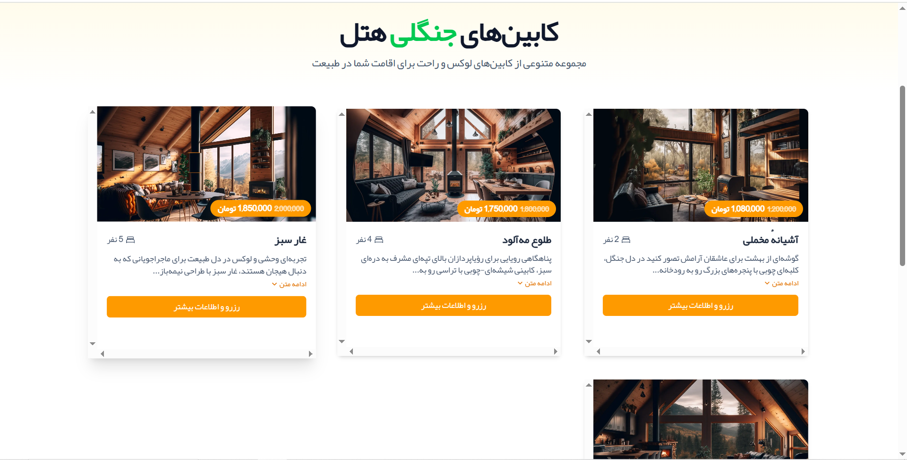
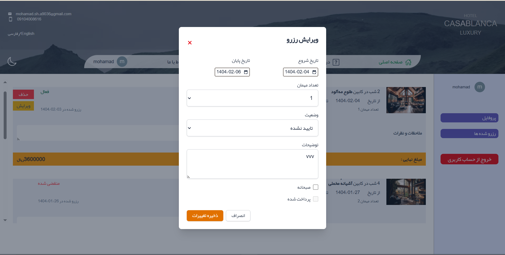
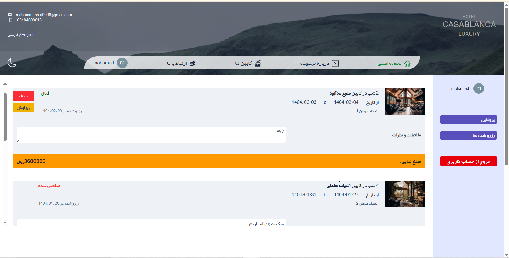
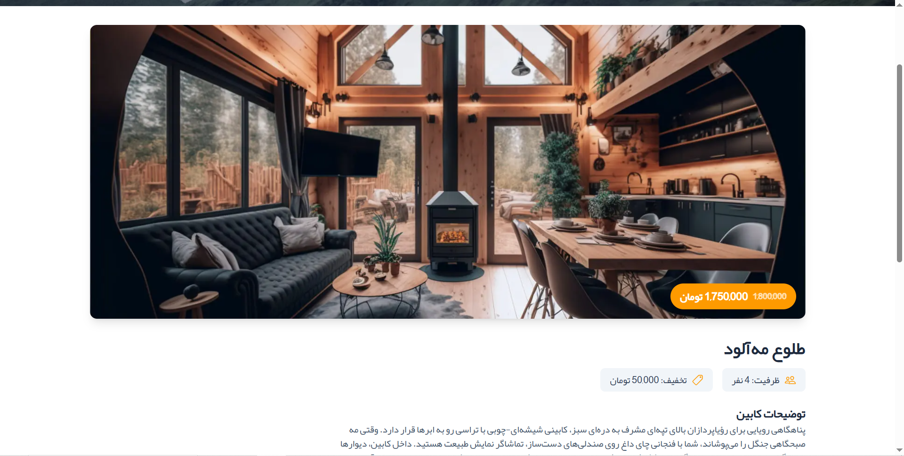

# Casablanca Hotel

([live demo:](https://casablanca-hotel.vercel.app/))



## Overview

A modern web application for Casablanca, providing a seamless booking experience and hotel information management system. It's a project created fo my portfolio and resume.

## Features

- Room booking and reservation system
- User authentication and profile management
- Room availability calendar
- Responsive design for all devices






## Tech Stack

- Frontend: React.js
- Styling: Tailwind css
- State Management: [ContextAPI]
- Backend: [Supabase]
- Database: [Supabase]

## Getting Started

### Prerequisites

- Node.js (at least V14)
- npm or yarn
- [Any other prerequisites]

### Installation

1. Clone the repository

```bash
git clone [https://github.com/mohamad8616/Casablanca-hotel.git]
```

2.Install dependencies

```bash
npm install
# or
yarn install
```

3.Start the development server

```bash
npm start
# or
yarn start
```

## Project Structure

```hotel-jangali/
├── src/
│   ├── components/
│   ├── pages/
│   ├── assets/
│   ├── styles/
│   └── utils/
├── public/
└── [other directories]
```

## Contributing

1. Fork the repository
2. Create your feature branch (`git checkout -b feature/AmazingFeature`)
3. Commit your changes (`git commit -m 'Add some AmazingFeature'`)
4. Push to the branch (`git push origin feature/AmazingFeature`)
5. Open a Pull Request

## Contact

Your Name - [mohamad.sh.a9036@gmail.com]
Project Link: [https://github.com/mohamad8616/Casablanca-hotel.git]
